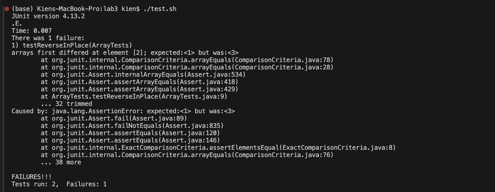
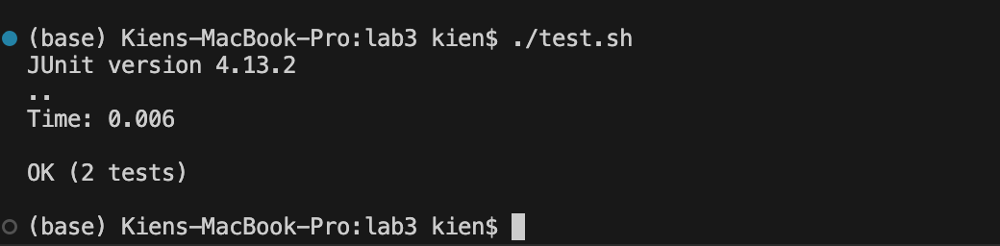

**Student's ArrayExamples.java**
```


public class ArrayExamples {

  // Changes the input array to be in reversed order
  static void reverseInPlace(int[] arr) {
    for(int i = 0; i < arr.length; i += 1) {
      arr[i] = arr[arr.length - i - 1];
    }
  }

  // Returns a *new* array with all the elements of the input array in reversed
  // order
  static int[] reversed(int[] arr) {
    int[] newArray = new int[arr.length];
    for(int i = 0; i < arr.length; i += 1) {
      arr[i] = newArray[arr.length - i - 1];
    }
    return arr;
  }

  // Averages the numbers in the array (takes the mean), but leaves out the
  // lowest number when calculating. Returns 0 if there are no elements or just
  // 1 element in the array
  static double averageWithoutLowest(double[] arr) {
    if(arr.length < 2) { return 0.0; }
    double lowest = arr[0];
    for(double num: arr) {
      if(num < lowest) { lowest = num; }
    }
    double sum = 0;
    for(double num: arr) {
      if(num != lowest) { sum += num; }
    }
    return sum / (arr.length - 1);
  }


}

```
**Student's Test.java**
```
import static org.junit.Assert.*;
import org.junit.*;

public class ArrayTests {
	@Test 
	public void testReverseInPlace() {
    int[] input1 = { 1,2,3 };
    ArrayExamples.reverseInPlace(input1);
    assertArrayEquals(new int[]{ 3,2,1 }, input1);
	}


  @Test
  public void testReversed() {
    int[] input1 = { };
    assertArrayEquals(new int[]{ }, ArrayExamples.reversed(input1));
  }
}
```

**What Might be Wrong**
It looks like there is something wrong with the ReverseInPlace method at element [2] where it is expecting an outcome of 1 but it was 3 instead. This might be because  the ReverseInPlace method changes the array while using the array so when the first element is changed to 3 the last element is changed to the first element which was 3 so to debug this we might have to use two different arrays.

**TA Question**
Why would the expected be 1 while the returned is 3? If 3 is apart of the original array then could there be a way that the 3 was used or unchanged to fill in the last element in the finalized reversed array?

**Student's revised ArrayExamples.java**
```


public class ArrayExamples {

  // Changes the input array to be in reversed order
  static void reverseInPlace(int[] arr) {
    int n = arr.length;
    for(int i = 0; i < n / 2; i++) {
        int temp = arr[i];
        arr[i] = arr[n - i - 1];
        arr[n - i - 1] = temp;
    }
  }

  // Returns a *new* array with all the elements of the input array in reversed
  // order
  static int[] reversed(int[] arr) {
    int[] newArray = new int[arr.length];
    for(int i = 0; i < arr.length; i += 1) {
      arr[i] = newArray[arr.length - i - 1];
    }
    return arr;
  }

  // Averages the numbers in the array (takes the mean), but leaves out the
  // lowest number when calculating. Returns 0 if there are no elements or just
  // 1 element in the array
  static double averageWithoutLowest(double[] arr) {
    if(arr.length < 2) { return 0.0; }
    double lowest = arr[0];
    for(double num: arr) {
      if(num < lowest) { lowest = num; }
    }
    double sum = 0;
    for(double num: arr) {
      if(num != lowest) { sum += num; }
    }
    return sum / (arr.length - 1);
  }


}

```
**The Test stayed the same**

The bug was that the original code changed the array one by one while using the same array as a reference. This means that after the first element was changed to the last element, the for loop reached the last loop and referenced the first element of the same array and because this element was already changed to the last element of the original array, the last element of the altered array will always be equal to the last element of the original array.

**Test.sh that ran the tests**
```
javac -cp .:lib/hamcrest-core-1.3.jar:lib/junit-4.13.2.jar *.java
java -cp .:lib/hamcrest-core-1.3.jar:lib/junit-4.13.2.jar org.junit.runner.JUnitCore ArrayTests
```

**Reflection**
Something cool that I learned was vim. I thought it was really interesting that I could go line to line and then also stop at a certain line of code and then debug from their. Before this I would us another website to go line to line in my code, but by using vim I can run two different java scripts and then go through only one of them to debug.
